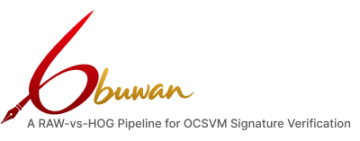
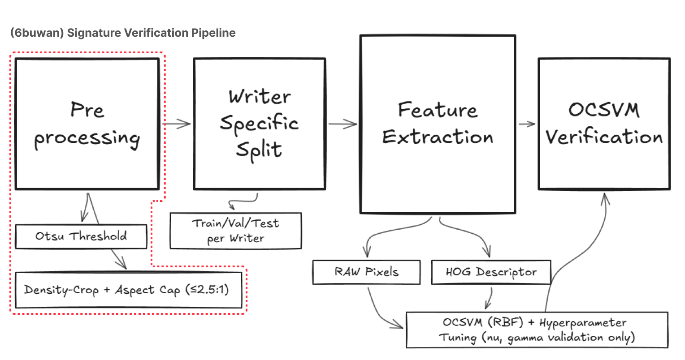
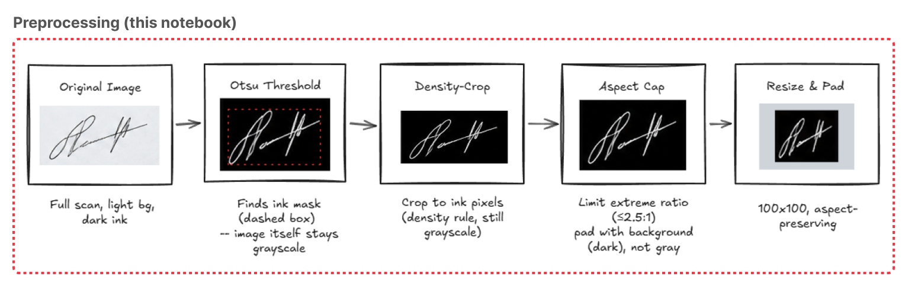
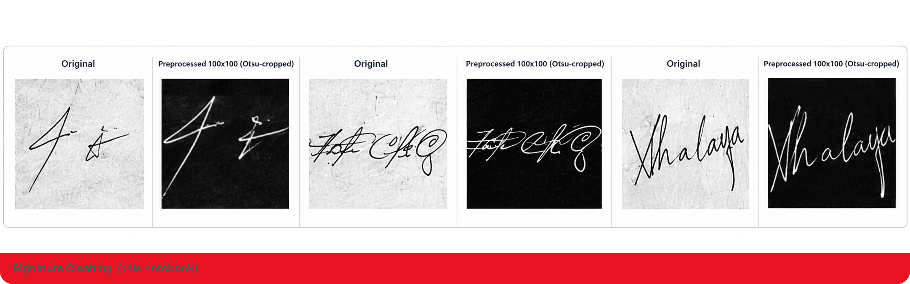
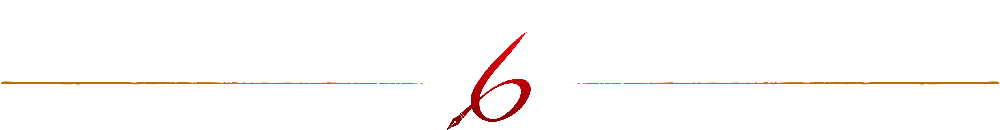

# 6buwan [Alpha]: A RAW-vs-HOG Pipeline for OCSVM Signature Verification

> 6buwan is in Alpha. Each experiment below is a locked, reproducible run the pipeline itself is still evolving.



## Why

A bank holds genuine specimen signatures for a depositor, never their forgeries in advance. That rules out ordinary two-class classification and forces a one-class formulation: a model per writer, fit only to that writer's genuine samples, that still has to catch forgery attempts it has never seen. Given that constraint, an obvious question follows is it worth extracting a hand-designed feature like HOG at all, or does a one-class model do just as well working directly on raw pixels? HOG was built to tolerate exactly the variation (stroke thickness, small shifts, local contrast) that raw pixels are sensitive to, so intuition favors it. 6buwan exists to test that intuition under a genuinely one-class, low-data regime, not assume it.

## Pipeline



Four stages, run identically for both feature representations so any performance gap traces back to the representation itself, not the plumbing: preprocess every scan the same way, split each writer's signatures into train / validation / final-test, extract RAW or HOG features from the same preprocessed image, then fit and score one OCSVM per writer.

## Preprocessing



An Otsu threshold finds the ink. A density-thresholded crop a row or column only counts if it holds at least 5% of the busiest row/column's ink removes blank margin without letting a thin trailing flourish stroke drag the crop into a sliver. A hard aspect-ratio cap (≤2.5:1) pads anything still too elongated before the final resize. Output stays grayscale rather than getting re-binarized, so HOG still sees soft gradient information at stroke edges.

```python
if width / height > max_aspect:
    target_h = ceil(width / max_aspect)   # ceil, not floor floor could leave the ratio over cap
    pad = max(0, target_h - height)
    img = np.pad(img, ((pad // 2, pad - pad // 2), (0, 0)), constant_values=0)
```



## Feature Representations

```python
def create_raw_features(image_paths):
    return np.array([preprocess_signature(p).astype(np.float32).flatten() / 255.0
                      for p in image_paths])

def create_hog_features(image_paths):
    return np.array([hog(preprocess_signature(p).astype(np.float32) / 255.0,
                          orientations=9, pixels_per_cell=(8, 8),
                          cells_per_block=(2, 2), block_norm="L2-Hys")
                      for p in image_paths])
```

**RAW** keeps absolute pixel intensity a signature's exact position and shading is the whole signal. **HOG** discards that for local gradient direction, on the premise that stroke direction survives the shifts and thickness changes that sink raw pixels.

## Verification Model

One RBF-kernel One-Class SVM per writer, trained only on that writer's own genuine signatures:

```python
model = OneClassSVM(kernel="rbf", nu=nu, gamma=gamma)
model.fit(X_writer_train)
```

`nu` and `gamma` are each swept over a fixed multiplier grid (0.01x–100x) centered on a data-driven reference gamma (`1 / (n_features * variance)`) RAW and HOG get their own reference, computed from their own dimensionality. Tuned once per representation, then locked before final-test data is touched.

## Evaluation

FAR, FRR, Accuracy, Precision, Recall, and F1 per writer, aggregated across writers, checked against reject-all / accept-all baselines and balanced accuracy since CEDAR's final-test set skews 80% forged. The UTSig cross-dataset run adds two threshold-independent checks: Matthews Correlation Coefficient (F1 alone can favor a trivial accept-all classifier on a balanced test set it did, once), and per-writer ROC-AUC from `decision_function` scores, to separate "is this representation worse" from "is it worse only at the specific operating point that got locked."

## Experiments

Why three notebooks per dataset instead of one:

**CEDAR**

| Notebook | What it is |
|---|---|
| [`experiment_1`](cedar/notebooks/cedar_experiment_1.ipynb) | First full run of the fixed pipeline (density-crop, aspect cap, anchored-grid tuning). Superseded by a rounding bug: the aspect-cap pad used `int()`, which floors and can leave the ratio slightly over the 2.5:1 cap. |
| [`experiment_2`](cedar/notebooks/cedar_experiment_2.ipynb) | **Locked, primary result.** Fixes `int()` → `ceil()`, adds a genuine↔forged cross-class duplicate check and a per-writer kernel-scale diagnostic, reports baselines and balanced accuracy. |
| [`experiment_3`](cedar/notebooks/cedar_experiment_3.ipynb) | `experiment_2` plus one bounded follow-up: does giving each writer 18 training signatures instead of 12 change the RAW-vs-HOG gap? |

**UTSig** (bonus cross-dataset check, run only after CEDAR was locked)

| Notebook | What it is |
|---|---|
| [`experiment_1`](utsig/notebooks/utsig_experiment_1.ipynb) | First UTSig run, CEDAR's locked pipeline reused as-is. |
| [`experiment_2`](utsig/notebooks/utsig_experiment_2.ipynb) | Methodology hardening after review: a cross-split duplicate-leak check (a signature byte-identical across train/validation/test would invalidate the split), a wider gamma grid, MCC, and per-writer ROC-AUC. |
| [`experiment_3`](utsig/notebooks/utsig_experiment_3.ipynb) | Adds one more angle on `experiment_2`'s real output: re-sorting the same validation grid by MCC instead of F1 surfaces a different operating point, reported side-by-side with the locked F1 result rather than replacing it. |

## Datasets

**CEDAR** - 55 writers, 24 genuine + 24 forged each. Per writer: 12 genuine train / 3 genuine + 12 forged validation / 3 genuine + 12 forged final-test. Forgeries are never used for training.

**UTSig** - 115 writers, 27 genuine + 6 skilled-forged each. Chosen because it's the only major alternative to CEDAR that isn't capped at the same 24 genuine/writer (GPDS is withdrawn; BHSig260 caps at 24; MCYT-75 offers only 15). Genuine split 21 / 3 / 3, skilled forgeries split 3 / 3 (validation / final-test), none held out for training.

## Key Findings So Far

| | CEDAR (locked) | UTSig (cross-dataset) |
|---|---|---|
| Winner by F1 | HOG 0.235 vs 0.198 | RAW 0.565 vs 0.482 |
| Winner by ROC-AUC | not computed | HOG 0.650 vs 0.583 |
| RAW-vs-HOG difference significant? | not tested | yes Wilcoxon p < 0.05 (F1 and FRR) |

No universal winner. HOG's edge on CEDAR shrinks as training data grows (12 → 18 signatures/writer, F1 converges to ~0.41 for both). On UTSig, RAW wins the locked operating point on F1, but HOG actually ranks signatures better overall a reminder that "which representation wins" can depend on which metric, and which operating point, you're asking about.

